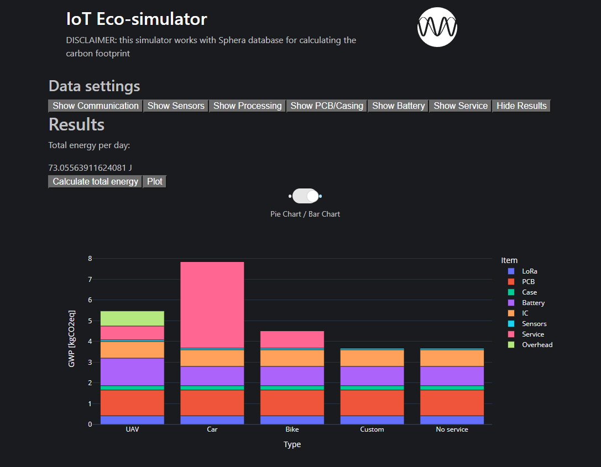

# Eco-Simulator

## How to use?
- Clone repo: `git clone https://github.com/jonacappelle/Eco-Simulator.git`
- Run the `eco_sim.exe` file.
- Open webbrowser: `http://localhost:8050/`
- Quantify used communication, sensors, microcontroller, PCB, casing, etc.
- An estimate daily energy budget is calculated.
- Choose the correct battery type & servicing methods (if applicable).
- The analysis can be found in the results tab.

## Example

## Disclaimer
This simulator uses mostly data from Sphera LCA databases, combined with own analysis and publicly available information. The tool is only intended to give a first impression in the carbon footprint of IoT devices.
